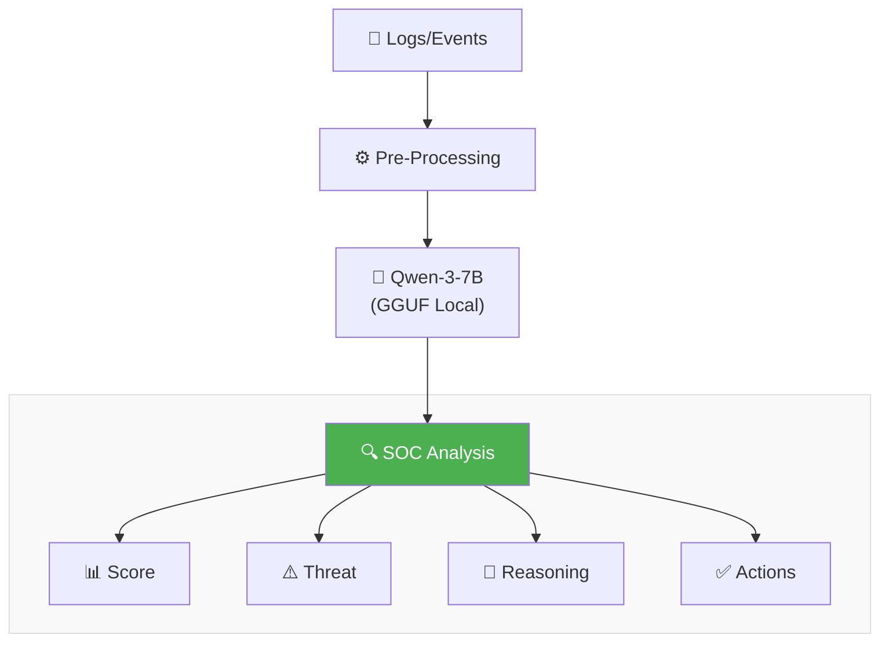

# 🛡️ Mini-LLM Powered SOC Assistant (Offline / Local) 

# **( work is ongoing/almost done 👍)**

An **offline, local SOC (Security Operations Center) analysis assistant** powered by a **Mini-LLM (Qwen-3-7B-Instruct GGUF)**.  
This project is designed for **SOC Analysts (L1/L2)** to analyze security logs, detect threats, assign severity scores, and recommend mitigation actions — **without internet dependency**.

> 🚧 **Status: WORK IN PROGRESS**  
> This project is actively under development. Features, UI, and analysis logic are continuously evolving.

---

## 🔥 Key Highlights

- ✅ **100% Offline / Local Execution**
- 🤖 **Mini-LLM based (Qwen-3-7B-Instruct .gguf)**
- 🧠 AI-assisted SOC log analysis
- 📊 Severity scoring (1–10)
- 📝 Threat summary + reasoning
- 🛠️ Actionable security recommendations
- 💾 Save & review past analyses
- 📤 Export reports (JSON / PDF)
- 🖥️ Lightweight SOC-style dashboard UI

---

## 🧠 What This SOC Assistant Does

The assistant analyzes security-related logs such as:

- Failed login attempts  
- Brute-force patterns  
- Suspicious user inputs (SQLi, auth bypass attempts, etc.)
- Unknown user activity
- Repeated IP-based anomalies  

Based on the input logs, the system automatically generates:

- **Severity Score (1–10)**
- **Threat Summary**
- **Detailed Reasoning**
- **Recommended Security Actions**

All analysis is performed **locally using the LLM**, making it suitable for **air-gapped environments** and **privacy-sensitive SOC setups**.

---

## 🧩 Architecture Overview

📱 Tap to view Architecture

---

## 🖥️ UI Features

- SOC-style dark themed dashboard
- Timestamped analysis
- Severity visualization
- Saved analysis history
- Search by IP / User / Event
- One-click export (JSON / PDF)

---

## ⚙️ Tech Stack

- **Model**: Qwen-3-7B-Instruct (.gguf)
- **Inference**: Local LLM runtime (llama.cpp compatible)
- **Backend**: Python (FastAPI / Flask – configurable)
- **Frontend**: HTML / CSS / JS (SOC-style UI)
- **Storage**: Local JSON files
- **Deployment**: Fully local (no cloud)

---

## 🧪 Example Use Case

- Detect brute-force login attempts from a single IP
- Identify authentication bypass attempts (`OR '1'='1'`)
- Assign risk severity automatically
- Get recommended mitigations such as:
  - Rate limiting
  - Auth hardening
  - Monitoring escalation

---

## 🚧 Work in Progress (Important)

This project is **NOT finished yet**. Planned improvements include:

- [ ] Better severity calibration
- [ ] MITRE ATT&CK mapping
- [ ] SOC alert categorization (Info / Low / Medium / High / Critical)
- [ ] Multi-log correlation
- [ ] Role-based SOC analyst views
- [ ] RAG integration for SOC playbooks
- [ ] Model fine-tuning for security logs
- [ ] Performance optimizations

---

## 🎯 Project Goal

To build a **lightweight, offline AI SOC assistant** that demonstrates:

- SOC analysis skills
- Cybersecurity knowledge
- Practical AI + security integration
- Real-world analyst-style reasoning

This project is intended for **learning, portfolio showcasing, and research**, especially for **SOC Analyst roles**.

---

## ⚠️ Disclaimer

This tool is for **educational and research purposes only**.  
It should **not** be used as a replacement for enterprise-grade SOC platforms in production environments.

---

## 👨‍💻 Author

**Ashish Gupta**  
Cybersecurity | SOC | AI-Powered Security Tools  

> If you’re a recruiter, analyst, or security engineer — feedback is welcome!

---

⭐ **Star this repo if you find it interesting**  
🚀 **More features coming soon**